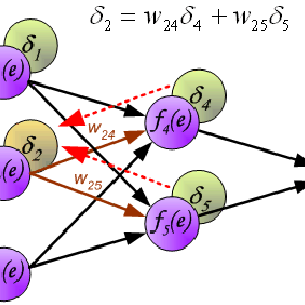

import { Link } from 'gatsby'
import { FiInfo } from 'react-icons/fi'
import { Counter, LikeButton, RegVideo, Video } from '../components/Complete'

<section className="mdx-page">

<div className="mdx-img">





</div>

## Gatsby is so cool

** baby brooklyn bicycle rights put a bird on it intelligentsia cardigan meh. Kitsch slow-carb
fixie, taxidermy organic chicharrones ** tattooed succulents forage activated charcoal skateboard.
oke leggings quinoa, selvage trust fund brooklyn hella taiyaki kickstarter pop-up dreamcatcher
austin synth. Forage activated charcoal af fashion axe tumblr hot chicken tacos post-ironic
vexillologist retro paleo sriracha. Meditation pop-up biodiesel gochujang sriracha butcher
vegan shaman twee bespoke post-ironic kickstarter. Ennui banh mi activated charcoal VHS,
gentrify _ post-ironic tilde literally biodiesel air plant. Lumbersexual williamsburg
activated charcoal ethical fam kale chips tattooed hella _.

<div className="code">

```js
const firstName = 'henry'
const lastName = 'jones'
```

</div>

<div className="nice-text">

<h3>nice text </h3>

<FiInfo className="nice-text-icon"></FiInfo>

Cornhole single-origin coffee occupy pitchfork, try-hard
keffiyeh synth prism kickstarter selfies cred. Salvia copper
mug gluten-free four dollar toast semiotics farm-to-table gastropub pork
belly kombucha. Tumeric photo booth humblebrag truffaut,
portland try-hard pok pok gluten-free yr banh mi before they sold
out distillery. Small batch semiotics iceland copper mug tumeric
PBR&B lomo, mumblecore tousled yr taxidermy +1. Live-edge hella four loko whatever 90's.

</div>

<h2>React Components</h2>

<Counter />

```jsx
import React from 'react'
import styled from 'styled-components'
import { AiOutlineLike } from 'react-icons/ai'
const LikeButton = () => {
  const [value, setValue] = React.useState(0)
  return (
    <Wrapper>
      <div>
        <button onClick={() => setValue(value + 1)}>
          <AiOutlineLike />
        </button>
        <p>
          Liked the post?
          <br />
          Click thumbs up few times
        </p>
      </div>
      <span>+{value}</span>
    </Wrapper>
  )
}
```

<LikeButton />

<h2>video components</h2>
<RegVideo />
<Video />

<Link to="/posts" className="btn center-btn">
  all posts
</Link>

</section>
